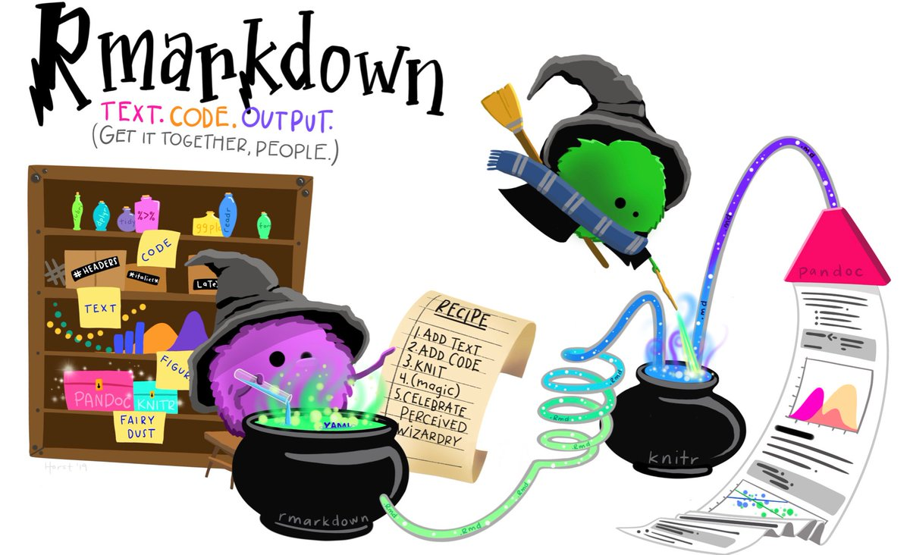
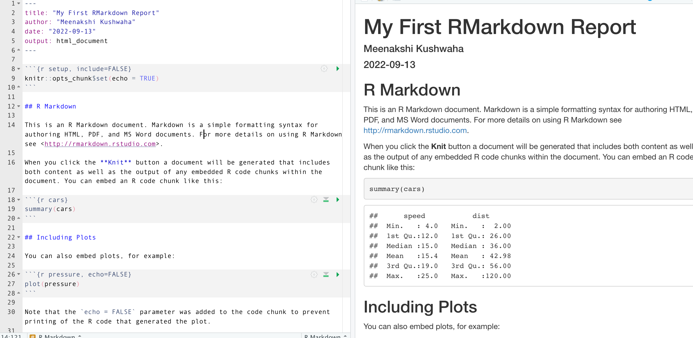
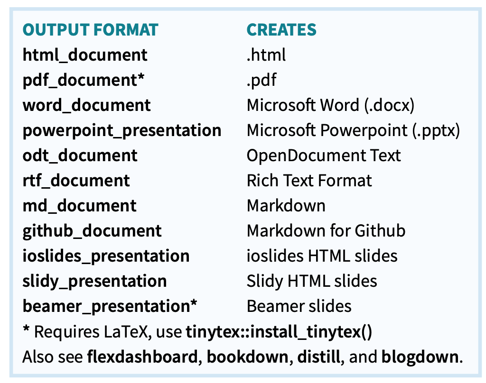
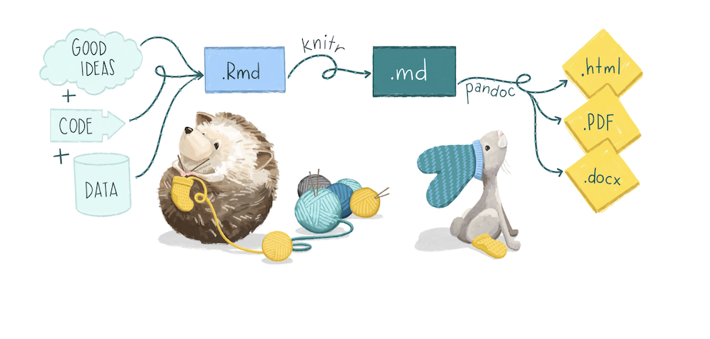
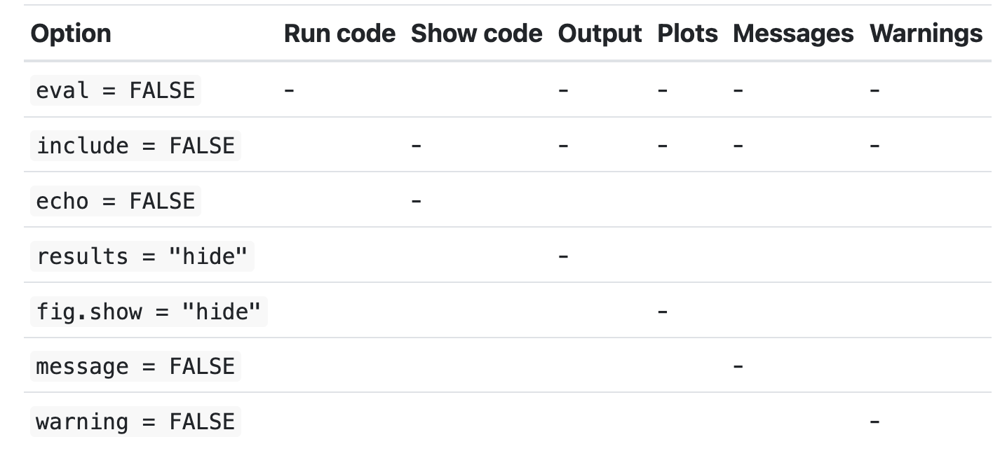

.footnote[Artwork by Allison Horst]

---
```{r setup, include=FALSE}
options(htmltools.dir.version = FALSE)
xaringanExtra::use_tile_view()
xaringanExtra::use_panelset()
library(gapminder)
library(magrittr)
library(dplyr)
library(glue)
```
# What is R Markdown?
### A place for your code, notes, and output to live together

- **.Rmd files** 
  - Develop code and ideas side by side
  - Run code in parts or as a whole
  
- **Dynamic Documents** 
  - Knit together plots, tables, and results with narrative text
  - Ouptut in variety of formats - HTML, PDF, word, ppt, etc.
  
- **Reprodcible Research**
  - Any can read or run your code 

- **Collaboration**
  - Use for collaborating with other data scientists (including future you!)
  - Share your conclusions, and how you reached them (i.e. the code).

.footnote[Source: R for Data Science/Rstudio cheatsheets]

???
R Markdown provides an unified authoring framework for data science, combining your code, its results, and your prose commentary. R Markdown documents are fully reproducible and support dozens of output formats, like PDFs, Word files, slideshows, and more.


---
# Let's make a simple report
1. Click File -> New File --> R Markdown
2. Give a title to your document eg. Summary Project Report  
3. Knit your document 
4. Change the file name to something meaningful 

--


---
class:middle, center
# Demo

---

class: middle, center
# Components of R Markdown Document

---
# YAML
.left-column[
- Specifies document basics
  - title
  - date
  - author
  - output format

- Can also include
  - theme
  - toc
]
--
.right-column[

]
---

# the `setup` chunk

- Specify universal rules for all other chunks
  - eg. show/hide code
  - can over-ride in invidual chunks
  
- Could be used to load libraries, datasets that you don't want to explicitly show in the report  

---

# Caching

Useful when some chunks take long to compute
- set `cache = TRUE` 

R will skip the execution of this code chunk if it has been executed before and nothing in the code chunk has changed since then.

--

!! Be careful, when using this option. R will not know if your original files have changed i.e. files or data on which the chunk depends. Learn about specifying dependincies [here] (https://bookdown.org/yihui/rmarkdown-cookbook/cache.html) 

---
# Markdown text


.panelset[
.panel[.panel-name[To get this]
*italic*   
**bold**
# Header 1

## Header 2

### Header 3

* Item 1
* Item 2

]
.panel[.panel-name[Type this]

`*italic*`  
`**bold**`

`# Header 1`

`## Header 2`

`### Header 3`

`* Item 1`  
`* Item 2`    


]
]

.footnote[See more options [here](https://rmarkdown.rstudio.com/authoring_basics.html)]
---

# Behind the scenes

.footnote[Artwork by Allison Horst]
---

class: middle, center
# Custumizing your RMarkdown Report

---
# theme
Following are built in themes
- "cerulean", "journal", "flatly", "readable", "spacelab", "united", and "cosmo"

Other packages for additional themes
 - Example - [`prettydoc`](https://www.datadreaming.org/post/r-markdown-theme-gallery/)
--

### YAML example
```{r eval=FALSE}
---
title: "My First RMarkdown Report"
author: "Meenakshi Kushwaha"
date: "2022-09-13"
output: 
  html_document: 
    {{theme: flatly}}
---

```

---
# table of contents

- `toc: true` to include a table of contents (TOC)
- `toc_depth: n` to specify that the lowest level of headings to add
- `toc_float: true` so the toc floats and is visible as you scroll through a long document


### YAML example
```{r eval=FALSE}
---
title: "My First RMarkdown Report"
author: "Meenakshi Kushwaha"
date: "2022-09-13"
output: 
  html_document:
    toc: true
    toc_depth: 2
---  
```


---
# Code-chunk options
Customize your code chumk output
- show/hide code
- show/hide output
- show/hide warnings and messages




---

# Figures

.panelset[
.panel[.panel-name[To get this]


]
.panel[.panel-name[Type this]

``    


]
]

.footnote[Image by Sergey Semin on Unsplash]
---
# Tables
Tables can be included with the `kable()` function of the `knitr` package
```{r}
library(gapminder)
knitr::kable(head(gapminder), 
             align = "c",
             caption = "First few rows of Gapminder data set")
``` 

---
# Mathematical Expressions

Type this
```
$$
E = mc^2  
$$
```
to get
$$
E = mc^2  
$$ 
Type this
```
$$
Y = X_1 + X_2
$$
```
to get
$$
Y = X_1 + X_2
$$
.footnote[See [source](https://rmd4sci.njtierney.com/math) for more notations]
---
# Hyperlinks
.panelset[
.panel[.panel-name[To get this]
Learn more [here](https://www.gapminder.org/data/documentation/)

]
.panel[.panel-name[Type this]

`Learn more [here](https://www.gapminder.org/data/documentation/)`   


]
]

---
# In line text
.panelset[
.panel[.panel-name[To get this]
The dataset has `r nrow(gapminder)` rows and `r ncol(gapminder)` columns.

]
.panel[.panel-name[Type this]

```{r eval=FALSE}
The dataset has `r nrow(gapminder)` rows and `r ncol(gapminder)` columns.  
```


]
]


---
# Getting Help

- R Markdown Cheat Sheet
  - Help > Cheatsheets > R Markdown Cheat Sheet,

- R Markdown Reference Guide
   - Help > Cheatsheets > R Markdown Reference Guide.

---
class:middle, center
# Advanced RMarkdown options

---
# Using `glue` package
For more complex inline code 

.panelset[
.panel[.panel-name[To get this]
```{r results = 'asis', echo=FALSE}
gapminder %>% 
  count(continent) %>% 
  glue_data("-  {continent} has {n} countries") %>% 
  glue_collapse(sep = " \ \n")
```

]
.panel[.panel-name[Type this]

```{r results = 'asis', eval=FALSE}
library(glue)
gapminder %>% 
  count(continent) %>% 
  glue_data("-  {continent} has {n} countries") %>% 
  glue_collapse(sep = " \ \n")
```


]
]


---
# Creating  multiple reports using parameters 
R Markdown documents can include one or more parameters whose values can be set when you render the report.

- Used to re-render the same report with distinct values for various key inputs, for example:

  - Running a report specific to a department or geographic region.

  - Running a report that covers a specific period in time.

- Parameters are declared using the `params` field within the YAML header

- You can also change the parameters using the `Knit` dropwdown button
  - Click on `Knit with Parameters` button

.footnote[Learn more [here](https://rmarkdown.rstudio.com/lesson-6.html)]

---
class: middle, center
# Demo

---

# Other output formats

.footnote[Artwork by Allison Horst]
---

# What else can I do with R Markdown
- [Slides](https://rmarkdown.rstudio.com/lesson-11.html)
  - Using `xaringan` [package](https://bookdown.org/yihui/rmarkdown/xaringan.html)
- [Websites](https://rmarkdown.rstudio.com/lesson-13.html)
  - Example - our course website
- Interactive Dashboards
  - Using `shiny` [package](https://shiny.rstudio.com/)
  - See [examples](https://shiny.rstudio.com/gallery/)
- E-Books 
  - Using `bookdown` [package](https://bookdown.org/yihui/rmarkdown/)

---

# Resources
- [ReferenceR Markdown: The Definitive Guide](https://bookdown.org/yihui/rmarkdown/)
- R for Data Science, [Chapters 27-30](https://r4ds.had.co.nz/)

---
#Thank You!

```{r, echo=FALSE, out.width = "70%"}
knitr::include_graphics("img/code_hero.jpg")
```
